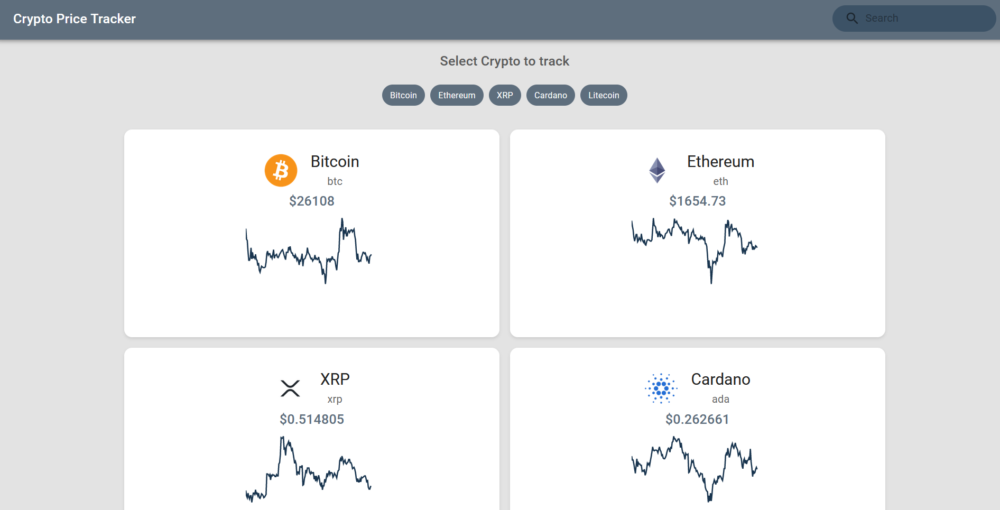

# Crypto Price Tracker

Crypto Price Tracker is a cryptocurrency price tracking application that allows you to monitor the latest trends and track your favorite cryptocurrencies. This application is designed to provide real-time information about cryptocurrencies, including their current price, 24-hour price change, market capitalization, and market capitalization rank.



## Features

- Real-time display of cryptocurrency prices
- Selection and tracking of favorite cryptocurrencies
- Graphical visualization of price changes over 7 days
- Search for cryptocurrencies by name and symbol

## Installation

1. Clone this repository to your local machine using the following command:

```bash
git clone https://github.com/your-username/crypto-price-tracker.git

2. Navigate to the project directory:
```bash
cd crypto-price-tracker

3. Install project dependencies using npm:
```bash
npm install

4. Start the application in development mode:
```bash
npm start

The application will be available at http://localhost:3000.

## Installation
Select the cryptocurrencies you want to track from the tags.
Click on a cryptocurrency card to view more information, including 24-hour price changes, market capitalization, and market capitalization rank.
Use the search bar to quickly find cryptocurrencies by name.

License

This project is licensed under the MIT License. Please refer to the LICENSE file for more information.
